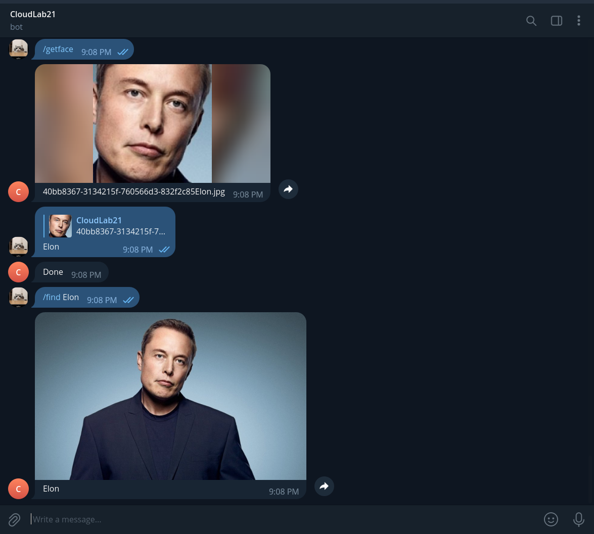

# Эрик Насибуллин, 11-902
- api-gateway.py - конфиг для gateway
- Dockerfile - для создания контейнера
- script.py - скрипт для контейнера
- vvot21-boot.py - ТГ бот
- vvot21-face-detection - распознавание лица
- TG-bot - https://t.me/CloudLab21_bot
Для запуска во все скрипты прокинуть в переменные окружения **aws_access_key_id** && **aws_secret_access_key**

Примеры:

